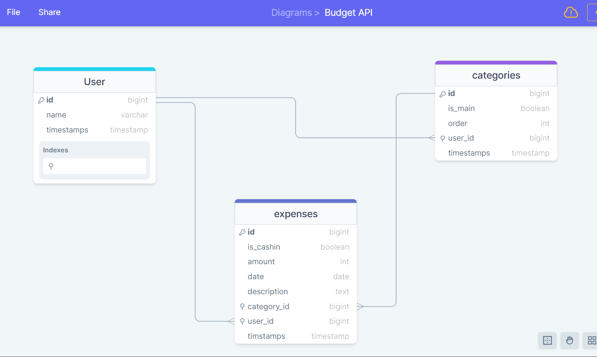

<a name="readme-top"></a>

<div align="center">
  
</div>

# 📗 Table of Contents

- [📗 Table of Contents](#-table-of-contents)
- [✒️ Uml Diagram](#diagram)
- [📖 Budget App ](#-vip_cars_rails-)
- [📖 Associate App ](#-vip_cars_rails-)
  - [🛠 Built With ](#-built-with-)
    - [Tech Stack ](#tech-stack-)
    - [Key Features ](#key-features-)
  - [📃 API Documentation](#api-docs)
  - [🗎 Kanban Board](#kanban-board)
  - [🚀 Live Demo ](#-live-demo-)
  - [💻 Getting Started ](#-getting-started-)
    - [Prerequisites](#prerequisites)
    - [Setup](#setup)
    - [Install](#install)
    - [Usage](#usage)
    - [Run tests](#run-tests)
    - [Deployment](#deployment)
  - [👥 Authors ](#-authors-)
  - [🔭 Future Features ](#-future-features-)
  - [🤝 Contributing ](#-contributing-)
  - [⭐️ Show your support ](#️-show-your-support-)
  - [🙏 Acknowledgments ](#-acknowledgments-)
  - [❓ FAQ ](#-faq-)
  - [📝 License ](#-license-)

<br />

# ✒️ UML Diagram <a name='diagram'></a>
<div align="center">
  
</div>

# 📖 Budget app Api <a name="about-project"></a>

**Budget app Api** is a backend for the Budget App Assignment that is built on rails framework. Potgresql for the internal servers 

# [📖 Budget App Frontend](https://github.com/PowerLevel9000/budget-app-frontend) <a name="about-project"></a>

Frontend of the app is build with typescript as language and React - Redux, to render expense, manage them,login... etc
visit there and Follow the prerequisites   

## 🛠 Built With <a name="built-with"></a>

- Ruby
- ROR 
- Postgresql


### Tech Stack <a name="tech-stack"></a>

[Ruby on Rails](https://guides.rubyonrails.org/) (simplify as Rails) is a server-side web application framework written in Ruby under the MIT License. Rails is a model–view–controller (MVC) framework, providing default structures for a database, a web service, and web pages. It encourages and facilitates the use of web standards such as JSON or XML for data transfer and HTML, CSS and JavaScript for user interfacing.

<details>
  <summary>Client</summary>
  <ul>
    <li><a href="https://www.ruby-lang.org/en/">Ruby</a></li>
  </ul>
</details>

<details>
  <summary>Server</summary>
  <ul>
    <li><a href="https://guides.rubyonrails.org/">Ruby on Rails</a></li>
  </ul>
</details>

<details>
<summary>Database</summary>
  <ul>
    <li><a href="https://www.postgresql.org/">PostgreSQL</a></li>
  </ul>
</details>

### Key Features <a name="key-features"></a>

*Key features of the application*

- **Login/Sign up**
- **Update User**
- **Manage Expenses**
- **MAnage Category of Expenses**

<p align="right">(<a href="#readme-top">back to top</a>)</p>

<!-- API Docs -->

## 🗎 API Documentation <a name="api-docs"></a>

- [] Currently under construction 


<!-- React Frontend -->

##  React Frontend <a name="react-frontend"></a>

- Frontend part of the project [Budget-app-frontend](https://github.com/PowerLevel9000/budget-app-frontend)

## 🚀 Live Demo <a name="live-demo"></a>

Under Construction

<p align="right">(<a href="#readme-top">back to top</a>)</p>

## 💻 Getting Started <a name="getting-started"></a>

To get a local copy up and running, follow these steps.

### Prerequisites

In order to run this project you need:

- Ruby and Rails on you operating system eg. for [Ubuntu 20.04](https://www.digitalocean.com/community/tutorials/how-to-install-ruby-on-rails-with-rbenv-on-ubuntu-20-04)
- React.js
- [Node.js](https://nodejs.dev/en/) installed
- [PostgreSQL](https://www.postgresql.org/) database installed

**Note** for [Frontend]() follow there prerequisites

### Setup

Clone this repository to your desired folder:

```sh
  cd my-folder
  git clone https://github.com/PowerLevel9000/budget_api.git
```

### Install

Install this project with:

```sh
  cd budget_api

  bundle install
```


### Usage

To run the project, execute the following command:

```sh
  rails s
```

### Run tests

To run tests, run the following command: for future

```sh
  bin/rails rspec spec
```

<p align="right">(<a href="#readme-top">back to top</a>)</p>

## 👥 Authors <a name="authors"></a>

👤 **Adarsh Pathak**

- GitHub: [@PowerLevel9000](https://github.com/PowerLevel9000)
- Twitter: [@PowerLevel9002](https://twitter.com/PowerLevel9002)
- LinkedIn: [Adarsh pathak](https://linkedin.com/in/PowerLevel)

<p align="right">(<a href="#readme-top">back to top</a>)</p>

## 🔭 Future Features <a name="future-features"></a>

- API Documentation
- Additional default features
- Unit Testing


<p align="right">(<a href="#readme-top">back to top</a>)</p>

## 🤝 Contributing <a name="contributing"></a>

Contributions, issues, and feature requests are welcome!

Feel free to check the [issues page](https://github.com/PowerLevel9000/budget_api/issues).

<p align="right">(<a href="#readme-top">back to top</a>)</p>

## ⭐️ Show your support <a name="support"></a>

If you like this project give this project a ⭐️.
*or*
[](https://buymeacoffee.com/adi8090808E)

<p align="right">(<a href="#readme-top">back to top</a>)</p>

## 🙏 Acknowledgments <a name="acknowledgements"></a>

I would like to acknowledge:

- [ROR Docs](https://guides.rubyonrails.org/index.html) for the Precise explanations

<p align="right">(<a href="#readme-top">back to top</a>)</p>

## ❓ FAQ <a name="faq"></a>

- **Is Rails still relevant?**

  - [Yes, Rails is still popular among developer](https://blog.railwaymen.org/is-ruby-on-rails-dead)

- **Is it easy to learn Ruby on Rails**

  - [It is very easy to learn compared to most of the programming languages](https://careerkarma.com/blog/why-learn-ruby-on-rails/)

<p align="right">(<a href="#readme-top">back to top</a>)</p>

<!-- LICENSE -->

## 📝 License <a name="license"></a>

This project is [GNU](./LICENSE) licensed.

<p align="right">(<a href="#readme-top">back to top</a>)</p>
